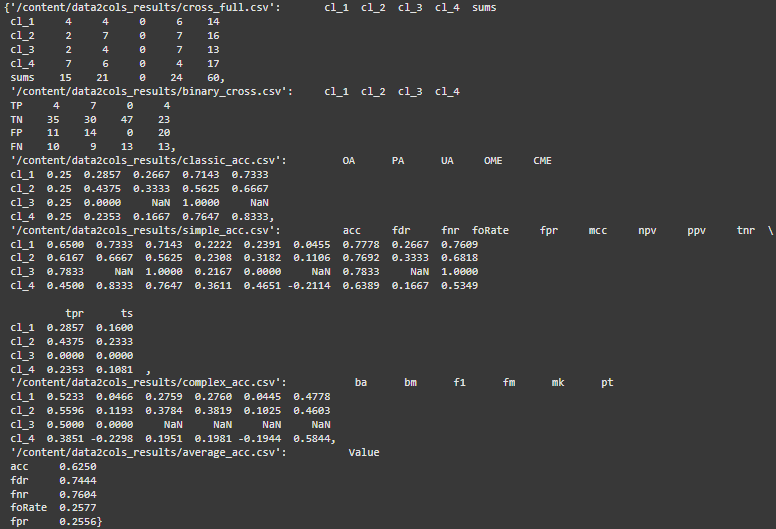
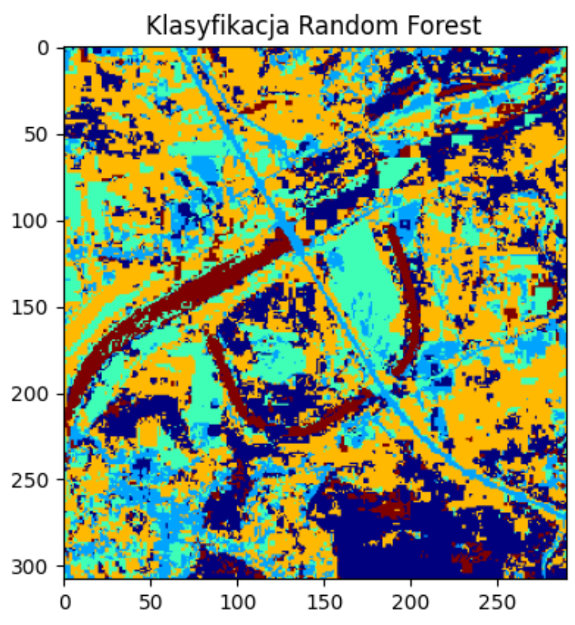

# Team Work Report

## 1. General Information
**Date:** 04.02.2025
**Team:** Team 5 
**Project:** Exam 
**Team Leader:** Bartosz Budek  

---

## 2. Work Summary
A brief description of overall project progress, key achievements, and any encountered issues.
Exam rules
You are working with teams. Team Leader: Created the repository. There is ONE document for the team report. Please organize the structure, and finally, each student should update the report. After the exam, you will exchange your reports and evaluate the reports of other teams (with individual scores for each student – the author must be listed in the report). Everyone in the team should provide an individual score, and I will calculate the average. You can vote anonymously within the team 🙂. Please organize this process.

You can use any help you want, but using your colleague's work is forbidden.

The data is in Teams in the corresponding folder.

NOTICE: The tasks are ordered by difficulty: Task 1 is the easiest, and Task 3 is the most difficult.

Task 1 Analysis of the correlation between temperature and NDVI
read temp 1 ndvi1
display 2 images with defiened palete
create 2 histograms
create scatter plot x=ndvi y=temp
repeat point 1-4 for temp2 and ndvi2

Perform analysis in Python and Matlab/Octave (both)

If you want to see the GEE code: https://code.earthengine.google.com/150e730dc6ea42320cc4091a9d6c1de0

Task 2 DEM analysis
read DEM
read point cloud
calculate differences: deltaH=point cloud H - DEM
calculate accuracy metrics
If you are able do all in Python, if not perform pre-processing in QGIS/ArcGIS/SAGA.. only accuracy anaysis make in Python OR Matlab/Octave

calculate difference between DEM 2024 - DEM 2021
check Groud Motion Service
Task 3 Classification accuracy
perform Sentinel-2 classification - K-Means any tool
download LULC map (i.e. Urban Atlas or Corine)
perform accuracy analysis using https://github.com/RemoteSys/accuracy
---

## 3. Team Members' Results

### 3.1 Member 1 - Bartosz Budek
- **Completed Tasks:**
  - [ ] Task 1
  - [ ] Task 2
  - [ ] Task 3


- **Code Implementation for Task3:**
  The following Python script calculates accuracy metrics.

  ```python
  !git clone https://github.com/RemoteSys/accuracy.git
  %cd accuracy
  !pip install -r requirements.txt
  !pip install .
  !accuracy /content/LULC_200_2021.tif
  !accuracy /content/data2cols.csv
  !accuracy /content/data2cols.csv -f "ac = (TP * TN - FP * FN) / ((TP + FP) * (TP + FN))**0.5"
  import pandas as pd
```python

import numpy as np

df = pd.read_csv("/content/data2cols.csv")

TP = df['TP'].sum()
TN = df['TN'].sum()
FP = df['FP'].sum()
FN = df['FN'].sum()

OA = (TP + TN) / (TP + TN + FP + FN)
PA = TP / (TP + FN)
UA = TP / (TP + FP)
OME = FN / (TP + FN)
CME = FP / (TP + FP)
NPV = TN / (TN + FN)
ACC = (TP + TN) / (TP + TN + FP + FN)
PPV = TP / (TP + FP)
TPR = TP / (TP + FN)
TNR = TN / (TN + FP)
FNR = FN / (FN + TP)
FPR = FP / (FP + TN)
FDR = FP / (FP + TP)
FOR = FN / (FN + TN)
TS = TP / (TP + FN + FP)
MCC = (TP * TN - FP * FN) / np.sqrt((TP + FP) * (TP + FN) * (TN + FP) * (TN + FN))
BA = (TPR + TNR) / 2
F1 = 2 * (PPV * TPR) / (PPV + TPR)
FM = np.sqrt(PPV * TPR)
BM = TPR + TNR - 1
MK = PPV + NPV - 1

metrics = {
    "Overall Accuracy (OA)": OA,
    "Producer Accuracy (PA)": PA,
    "User Accuracy (UA)": UA,
    "Omission Error (OME)": OME,
    "Commission Error (CME)": CME,
    "Negative Predictive Value (NPV)": NPV,
    "Accuracy (ACC)": ACC,
    "Precision (PPV)": PPV,
    "Recall (TPR)": TPR,
    "Specificity (TNR)": TNR,
    "False Negative Rate (FNR)": FNR,
    "False Positive Rate (FPR)": FPR,
    "False Discovery Rate (FDR)": FDR,
    "False Omission Rate (FOR)": FOR,
    "Threat Score (TS)": TS,
    "Matthews Correlation Coefficient (MCC)": MCC,
    "Balanced Accuracy (BA)": BA,
    "F1 Score": F1,
    "Fowlkes-Mallows Index (FM)": FM,
    "Informedness (BM)": BM,
    "Markedness (MK)": MK,
}

for key, value in metrics.items():
    print(f"{key}: {value:.4f}")
    
  import pandas as pd

  df = pd.read_csv("data2cols.csv")

  df["OA"] = df["TP"] / (df["TP"] + df["TN"] + df["FP"] + df["FN"])
  df["PA"] = df["TP"] / (df["TP"] + df["FN"])
  df["UA"] = df["TP"] / (df["TP"] + df["FP"])

  df.to_csv("classic_acc.csv", index=False)
  print("Results saved to classic_acc.csv")

import pandas as pd

file_paths = [
    "/content/data2cols_results/cross_full.csv",
    "/content/data2cols_results/binary_cross.csv",
    "/content/data2cols_results/classic_acc.csv",
    "/content/data2cols_results/simple_acc.csv",
    "/content/data2cols_results/complex_acc.csv",
    "/content/data2cols_results/average_acc.csv"
]

results = {}
for path in file_paths:
    try:
        df = pd.read_csv(path)
        results[path] = df.head()  # Wyświetlenie pierwszych kilku wierszy
    except Exception as e:
        results[path] = f"Error loading file: {e}"

results
```




---
# Task2
```python

import rasterio
import numpy as np
import geopandas as gpd

# Ścieżki do plików
dem_file = path
point_cloud_file = path

def load_dem(file_path):
    """Wczytuje dane DEM oraz macierz transformacji."""
    with rasterio.open(file_path) as src:
        elevation_data = src.read(1)  # Pobranie pierwszego pasma
        affine_transform = src.transform
    return elevation_data, affine_transform

def load_point_cloud(file_path):
    """Wczytuje chmurę punktów z pliku wektorowego (SHP)."""
    return gpd.read_file(file_path)

def extract_dem_elevation(elevation_data, transform, x_coord, y_coord):
    """Interpoluje wysokość DEM dla podanych współrzędnych."""
    col, row = ~transform * (x_coord, y_coord)  # Transformacja współrzędnych
    row, col = round(row), round(col)
    
    if 0 <= row < elevation_data.shape[0] and 0 <= col < elevation_data.shape[1]:
        return elevation_data[row, col]
    return np.nan  # Wartość poza zakresem

def compute_height_differences(dem_data, transform, points):
    """Oblicza różnice wysokości między chmurą punktów a DEM."""
    points['DEM_Height'] = points.apply(lambda p: extract_dem_elevation(dem_data, transform, p.geometry.x, p.geometry.y), axis=1)
    points['Height_Diff'] = points['Z'] - points['DEM_Height']
    return points

def evaluate_accuracy(errors):
    """Oblicza metryki dokładnościowe na podstawie różnic wysokości."""
    height_diff = errors['Height_Diff'].dropna()
    mean_err = np.mean(height_diff)
    rmse_val = np.sqrt(np.mean(height_diff ** 2))
    std_dev_val = np.std(height_diff)
    
    return {
        'Mean Error': mean_err,
        'RMSE': rmse_val,
        'Standard Deviation': std_dev_val
    }

def display_metrics(results):
    """Wyświetla wyniki dokładności."""
    print("\n--- Accuracy Metrics ---")
    print(f"Mean Error: {results['Mean Error']:.2f} m")
    print(f"RMSE: {results['RMSE']:.2f} m")
    print(f"Standard Deviation: {results['Standard Deviation']:.2f} m")

def main(dem_file, point_cloud_file):
    """Główna funkcja przetwarzania danych."""
    dem_data, affine = load_dem(dem_file)
    point_cloud = load_point_cloud(point_cloud_file)
    processed_points = compute_height_differences(dem_data, affine, point_cloud)
    accuracy_results = evaluate_accuracy(processed_points)
    display_metrics(accuracy_results)
    return processed_points, accuracy_results

if __name__ == "__main__":
    main(dem_file, point_cloud_file)

```


#Task 1

```python
import cv2
import numpy as np
import matplotlib.pyplot as plt

# Wczytanie plików TIFF
lst_img_1 = cv2.imread("t1_lst2023_Jul_Aug.tif", cv2.IMREAD_UNCHANGED)
ndvi_img_1 = cv2.imread("t1_ndvi2023_Jul_Aug.tif", cv2.IMREAD_UNCHANGED)
lst_img_2 = cv2.imread("t2_lst2023_Jul_Aug.tif", cv2.IMREAD_UNCHANGED)
ndvi_img_2 = cv2.imread("t2_ndvi2023_Jul_Aug.tif", cv2.IMREAD_UNCHANGED)

# Funkcja do wyświetlania obrazów w skali szarości
def show_grayscale(image, title, ax):
    ax.imshow(image, cmap='gray')
    ax.set_title(title)
    ax.axis('off')

# Wyświetlenie obrazów
fig, axes = plt.subplots(2, 2, figsize=(10, 10))

show_grayscale(lst_img_1, "LST - Obraz 1", axes[0, 0])
show_grayscale(ndvi_img_1, "NDVI - Obraz 1", axes[0, 1])
show_grayscale(lst_img_2, "LST - Obraz 2", axes[1, 0])
show_grayscale(ndvi_img_2, "NDVI - Obraz 2", axes[1, 1])

plt.tight_layout()
plt.show()

# Funkcja do normalizacji i konwersji do palety kolorów RGB
def convert_to_rgb(image):
    norm_img = cv2.normalize(image, None, 0, 1, cv2.NORM_MINMAX, dtype=cv2.CV_32F)
    colormap = plt.get_cmap('jet')
    rgb_img = colormap(norm_img)
    return (rgb_img[:, :, :3] * 255).astype(np.uint8)

# Konwersja obrazów
rgb_lst_1 = convert_to_rgb(lst_img_1)
rgb_ndvi_1 = convert_to_rgb(ndvi_img_1)
rgb_lst_2 = convert_to_rgb(lst_img_2)
rgb_ndvi_2 = convert_to_rgb(ndvi_img_2)

# Wyświetlenie obrazów RGB
fig, axes = plt.subplots(2, 2, figsize=(10, 10))

axes[0, 0].imshow(rgb_lst_1)
axes[0, 0].set_title("RGB LST - Obraz 1")
axes[0, 1].imshow(rgb_ndvi_1)
axes[0, 1].set_title("RGB NDVI - Obraz 1")
axes[1, 0].imshow(rgb_lst_2)
axes[1, 0].set_title("RGB LST - Obraz 2")
axes[1, 1].imshow(rgb_ndvi_2)
axes[1, 1].set_title("RGB NDVI - Obraz 2")

for ax in axes.flat:
    ax.set_xticks([])
    ax.set_yticks([])

plt.tight_layout()
plt.show()

# Funkcja do tworzenia histogramu
def plot_hist(image, title, ax):
    ax.hist(image.ravel(), bins=256, color='blue', alpha=0.7)
    ax.set_title(title)
    ax.set_xlim(0, 255)

# Tworzenie histogramów
fig, axes = plt.subplots(2, 2, figsize=(12, 12))
plot_hist(lst_img_1, "Histogram LST - Obraz 1", axes[0, 0])
plot_hist(ndvi_img_1, "Histogram NDVI - Obraz 1", axes[0, 1])
plot_hist(lst_img_2, "Histogram LST - Obraz 2", axes[1, 0])
plot_hist(ndvi_img_2, "Histogram NDVI - Obraz 2", axes[1, 1])

plt.tight_layout()
plt.show()

# Funkcja do tworzenia wykresu rozrzutu
def scatter_plot(ndvi, lst, title, ax):
    ax.scatter(ndvi.ravel(), lst.ravel(), alpha=0.5, s=1)
    ax.set_title(title)
    ax.set_xlabel("NDVI")
    ax.set_ylabel("LST")

# Tworzenie wykresów rozrzutu
fig, axes = plt.subplots(1, 2, figsize=(14, 7))
scatter_plot(ndvi_img_1, lst_img_1, "Wykres rozrzutu - Obraz 1", axes[0])
scatter_plot(ndvi_img_2, lst_img_2, "Wykres rozrzutu - Obraz 2", axes[1])

plt.tight_layout()
plt.show()
```


### 3.2 Member 2 - Aleksandra Barnach 
- **Completed Tasks:**
  - [ ] Task 1
  - [ ] Task 2
  - [ ] Task 3

- **Code Implementation for Task3:**
  The following Python script calculates K-means classification.

This code reads a GeoTIFF raster image, reshapes it into a 2D array, and applies the K-Means clustering algorithm to classify the pixels into 5 clusters. It filters out invalid or zero values before clustering, then reconstructs the classified image back to its original dimensions. The result is visualized using a color map, and the classified image is saved as a new GeoTIFF file.


```python

!pip install rasterio
import rasterio
print("Rasterio imported successfully!")
import numpy as np
import matplotlib.pyplot as plt
from sklearn.cluster import KMeans

# Ścieżka do pliku
raster_path = "/content/raster.tif"

# Odczytanie pliku GeoTIFF
with rasterio.open(raster_path) as src:
    image = src.read()  # Załaduj wszystkie pasma (bands)
    profile = src.profile  # Zapisz metadane

# Przekształcenie danych na format 2D (piksele x kanały)
num_bands, height, width = image.shape
image_2d = image.reshape(num_bands, -1).T  # Transponowanie dla K-Means

# Usunięcie NaN i wartości zerowych
valid_pixels = np.all(image_2d > 0, axis=1)
filtered_data = image_2d[valid_pixels]

# Klasyfikacja K-Means (np. 5 klas)
kmeans = KMeans(n_clusters=5, random_state=42, n_init=10)
kmeans.fit(filtered_data)

# Przypisanie etykiet do pikseli
labels = np.full(image_2d.shape[0], -1)  # Domyślnie -1 dla odfiltrowanych pikseli
labels[valid_pixels] = kmeans.labels_

# Rekonstrukcja do oryginalnych wymiarów
classified_image = labels.reshape(height, width)

# Wizualizacja
plt.figure(figsize=(10, 10))
plt.imshow(classified_image, cmap='tab10')
plt.colorbar(label='Cluster Label')
plt.title("Sentinel-2 K-Means Classification")
plt.show()

# Zapis wyników
output_path = "/content/classified.tif"
with rasterio.open(
    output_path, 'w', driver='GTiff',
    height=height, width=width, count=1,
    dtype=rasterio.uint8, crs=profile['crs'],
    transform=profile['transform']
) as dst:
    dst.write(classified_image.astype(rasterio.uint8), 1)

print(f"Classified image saved to {output_path}")


  ```


- **Code Implementation:**
  The following Python script calculates accuracy analysis.

This code performs a classification accuracy assessment on raster data. It first reads a raster image and extracts the unique pixel values. It then simulates ground truth reference data for comparison. After flattening both the raster data and reference data, it removes any NoData values. The code computes the confusion matrix, overall accuracy, and a detailed classification report. Finally, it visualizes the confusion matrix using a color map to display the classification performance. The results provide insights into how well the raster data matches the reference ground truth data.

```python

!pip install rasterio
import rasterio
print("Rasterio imported successfully!")
from sklearn.cluster import KMeans
import numpy as np
import pandas as pd
from sklearn.metrics import confusion_matrix, accuracy_score, classification_report
import matplotlib.pyplot as plt

# Wczytaj raster
raster_path = "/content/raster.tif"
with rasterio.open(raster_path) as src:
    raster_data = src.read(1)  # Zakładamy, że raster ma tylko jedną warstwę
    profile = src.profile

# Sprawdź wartości unikalne (przydatne dla klasyfikacji)
unique_values = np.unique(raster_data)
print("Unikalne wartości w rastrze:", unique_values)

ground_truth_data = np.random.choice(unique_values, raster_data.shape)  # Symulacja referencji


# Spłaszczanie danych (potrzebne do analizy klasyfikacji)
flattened_raster = raster_data.flatten()
flattened_truth = ground_truth_data.flatten()

# Usunięcie wartości NoData (jeśli istnieją, np. -9999)
mask = (flattened_truth >= 0)  # Dostosuj w zależności od NoData w Twoim rastrze
flattened_raster = flattened_raster[mask]
flattened_truth = flattened_truth[mask]

# Obliczenie macierzy błędów
conf_matrix = confusion_matrix(flattened_truth, flattened_raster)
print("Macierz błędów:\n", conf_matrix)

# Obliczenie dokładności
overall_acc = accuracy_score(flattened_truth, flattened_raster)
print("Ogólna dokładność:", overall_acc)

# Szczegółowy raport klasyfikacji
report = classification_report(flattened_truth, flattened_raster, zero_division=0)
print("Raport klasyfikacji:\n", report)

# Wizualizacja macierzy błędów
plt.figure(figsize=(8, 6))
plt.imshow(conf_matrix, cmap="Blues", interpolation="nearest")
plt.colorbar(label="Liczba pikseli")
plt.xlabel("Przewidywane klasy")
plt.ylabel("Referencyjne klasy")
plt.title("Macierz błędów")
plt.show()

  ```

Macierz błędów:
 [[4079 2320 3226 6818 1297]
 [4227 2245 3227 6867 1255]
 [4160 2288 3262 6747 1282]
 [4308 2258 3293 6850 1292]
 [4247 2334 3215 6917 1306]]


Raport klasyfikacji:
               precision    recall  f1-score   support

           1       0.19      0.23      0.21     17740
           3       0.20      0.13      0.15     17821
           4       0.20      0.18      0.19     17739
           6       0.20      0.38      0.26     18001
           8       0.20      0.07      0.11     18019

    accuracy                           0.20     89320
   macro avg       0.20      0.20      0.19     89320
weighted avg       0.20      0.20      0.19     89320


- **Code Implementation:**
  The following Python script calculates accuracy analysis between.

This code loads two raster files: one representing a classified image and the other serving as a reference for accuracy assessment. It includes functions to load the raster data, calculate classification accuracy using metrics like confusion matrix, overall accuracy, and Kappa coefficient, and then performs two classification methods: K-Means clustering and Random Forest classification. The K-Means algorithm classifies the raster data into a specified number of clusters, while the Random Forest classifier uses the reference raster for training and prediction. The results of both classification methods, along with the original raster, are visualized using different color maps (`'gray'`, `'viridis'`, and `'plasma'`).

```python
!pip install rasterio
print("Rasterio imported successfully!")
from sklearn.cluster import KMeans
import pandas as pd
from sklearn.metrics import confusion_matrix, accuracy_score, classification_report
import matplotlib.pyplot as plt
import numpy as np
import rasterio
from sklearn.metrics import confusion_matrix, accuracy_score
from sklearn.metrics import cohen_kappa_score
from sklearn.cluster import KMeans
from sklearn.ensemble import RandomForestClassifier
from sklearn.metrics import confusion_matrix, accuracy_score, cohen_kappa_score, classification_report
import numpy as np
import rasterio
import matplotlib.pyplot as plt

def load_raster(file_path): 
    try:
        with rasterio.open(file_path) as src:
            return src.read(1), src.profile
    except Exception as e:
        print(f"Error loading raster {file_path}: {e}")
        return None, None

def accuracy_assessment(raster_path, reference_path): 
    raster, _ = load_raster(raster_path)
    reference, _ = load_raster(reference_path)
    
    if raster is None or reference is None:
        print("Error: One or both rasters could not be loaded.")
        return None, None, None
    
    # Flatten arrays and remove nodata values (assuming 0 as nodata, modify if needed)
    mask = (reference > 0) & (raster > 0)
    
    if not np.any(mask):
        print("Error: No valid data found after applying mask.")
        return None, None, None
    
    raster_values = raster[mask].flatten()
    reference_values = reference[mask].flatten()
    
    # Compute confusion matrix and metrics
    conf_matrix = confusion_matrix(reference_values, raster_values)
    overall_acc = accuracy_score(reference_values, raster_values)
    kappa = cohen_kappa_score(reference_values, raster_values)
    
    return conf_matrix, overall_acc, kappa

def classify_kmeans(raster, n_clusters=5):
    masked_values = raster[raster > 0].reshape(-1, 1)  # Przygotowanie danych
    kmeans = KMeans(n_clusters=n_clusters, random_state=42, n_init=10)
    classified = np.zeros_like(raster)
    classified[raster > 0] = kmeans.fit_predict(masked_values) + 1  # Klasy od 1
    return classified

def classify_random_forest(raster, reference):
    mask = (reference > 0) & (raster > 0)
    X_train = raster[mask].reshape(-1, 1)
    y_train = reference[mask].flatten()
    rf = RandomForestClassifier(n_estimators=100, random_state=42)
    rf.fit(X_train, y_train)
    classified = np.zeros_like(raster)
    classified[raster > 0] = rf.predict(raster[raster > 0].reshape(-1, 1))
    return classified

# Ścieżki do plików
raster_path = "/content/raster.tif"
reference_path = "/content/reference_raster.tif"

# Analiza dokładności
conf_matrix, overall_acc, kappa = accuracy_assessment(raster_path, reference_path)
if conf_matrix is not None:
    print("Confusion Matrix:\n", conf_matrix)
    print("Overall Accuracy:", overall_acc)
    print("Kappa Coefficient:", kappa)

    # Wczytanie rastra do klasyfikacji
    raster, _ = load_raster(raster_path)
    
    # Klasyfikacja metodą K-Means
    classified_kmeans = classify_kmeans(raster)
    
    # Klasyfikacja metodą Random Forest
    reference, _ = load_raster(reference_path)
    classified_rf = classify_random_forest(raster, reference)
    
    # Wizualizacja wyników
    fig, axs = plt.subplots(1, 3, figsize=(15, 5))
    axs[0].imshow(raster, cmap='gray')
    axs[0].set_title('Oryginalny raster')
    axs[1].imshow(classified_kmeans, cmap='jet')
    axs[1].set_title('Klasyfikacja K-Means')
    axs[2].imshow(classified_rf, cmap='jet')
    axs[2].set_title('Klasyfikacja Random Forest')
    plt.show()

  ```

Confusion Matrix:
 [[14270   712   696  2178  2119]
 [  903  7236  1882  1805   214]
 [  162  1665  8839  2936    68]
 [ 4544  1798  3884 26910  1119]
 [ 1142    34   922   370  2912]]
Overall Accuracy: 0.6736117330944917
Kappa Coefficient: 0.5553154406438725





## Task 2

  ```

import rasterio
import numpy as np
import geopandas as gpd

# Ścieżki do danych
sciezka_dem = path
sciezka_chmury_punktow = path

def wczytaj_dem(sciezka):
    """Odczytuje dane DEM i zwraca macierz wysokości oraz transformację."""
    with rasterio.open(sciezka) as plik:
        wysokosci = plik.read(1)
        transformacja = plik.transform
    return wysokosci, transformacja

def wczytaj_chmure_punktow(sciezka):
    """Wczytuje plik wektorowy zawierający chmurę punktów."""
    return gpd.read_file(sciezka)

def interpoluj_wysokosc(wysokosci, transformacja, x, y):
    """Pobiera wysokość z DEM na podstawie współrzędnych."""
    kolumna, wiersz = ~transformacja * (x, y)
    wiersz, kolumna = round(wiersz), round(kolumna)
    
    if 0 <= wiersz < wysokosci.shape[0] and 0 <= kolumna < wysokosci.shape[1]:
        return wysokosci[wiersz, kolumna]
    return np.nan

def oblicz_roznice_wysokosci(dem, transformacja, punkty):
    """Dodaje do tabeli wysokości z DEM oraz różnice wysokości."""
    punkty['Wysokosc_DEM'] = punkty.apply(lambda pkt: interpoluj_wysokosc(dem, transformacja, pkt.geometry.x, pkt.geometry.y), axis=1)
    punkty['Roznica_Wysokosci'] = punkty['Z'] - punkty['Wysokosc_DEM']
    return punkty

def oblicz_metryki(roznice):
    """Wylicza statystyki błędu dla różnic wysokości."""
    blad = roznice['Roznica_Wysokosci'].dropna()
    return {
        'Sredni Blad': np.mean(blad),
        'RMSE': np.sqrt(np.mean(blad ** 2)),
        'Odchylenie Standardowe': np.std(blad)
    }

def wyswietl_metryki(metryki):
    """Wyświetla wyniki dokładności w czytelnej formie."""
    print("\n--- Metryki Dokładności ---")
    for klucz, wartosc in metryki.items():
        print(f"{klucz}: {wartosc:.2f} m")

def przetwarzaj_dane(sciezka_dem, sciezka_chmury):
    """Główna funkcja obsługi przetwarzania danych wysokościowych."""
    dem, transformacja = wczytaj_dem(sciezka_dem)
    chmura_punktow = wczytaj_chmure_punktow(sciezka_chmury)
    punkty_przetworzone = oblicz_roznice_wysokosci(dem, transformacja, chmura_punktow)
    wyniki_dokladnosci = oblicz_metryki(punkty_przetworzone)
    wyswietl_metryki(wyniki_dokladnosci)
    return punkty_przetworzone, wyniki_dokladnosci

if __name__ == "__main__":
    przetwarzaj_dane(sciezka_dem, sciezka_chmury_punktow)
  ```


This code imports elevation model (DEM) data and a 3D point cloud in shapefile format, then computes the elevation differences between the DEM values and the points in the cloud. Based on these differences, accuracy metrics such as mean error, RMSE (root mean square error), and standard deviation are derived. The results indicate an average height difference of 4.05 meters, which represents a substantial error. The RMSE of 9.25 meters highlights a significant variation, while the standard deviation of 8.31 meters reveals a broad range of errors across the examined points.


- **Notes:**
- **Issues/Challenges:**
- **Plans for the Next Period:**

---

### 3.3 Member 3 - Wiktoria Gądek
- **Completed Tasks:**
  - [ ] Task 1
  - [ ] Task 2
  
 ```python
import rasterio
import numpy as np
import geopandas as gpd


dem_file_path = path
point_cloud_file_path = path

# Funkcja do odczytu DEM
def load_dem(dem_file_path):
    with rasterio.open(dem_file_path) as dem_file:
        dem_array = dem_file.read(1)  # Odczyt pierwszej warstwy
        transform_info = dem_file.transform
    return dem_array, transform_info

# Funkcja do odczytu chmury punktów
def load_point_cloud(point_cloud_file_path):
    point_cloud_df = gpd.read_file(point_cloud_file_path)  # Wczytanie SHP
    return point_cloud_df

# Funkcja do interpolacji wysokości DEM dla podanych współrzędnych
def get_dem_height_at_coords(dem_array, transform_info, x, y):
    col, row = ~transform_info * (x, y)  # Przemiana współrzędnych
    row, col = int(round(row)), int(round(col))
    if 0 <= row < dem_array.shape[0] and 0 <= col < dem_array.shape[1]:
        return dem_array[row, col]
    return np.nan  # Jeśli współrzędne poza zakresem DEM

# Funkcja do obliczania różnic wysokości
def compute_height_differences(dem_array, transform_info, point_cloud_df):
    point_cloud_df['DEM_Height'] = point_cloud_df.apply(lambda point: get_dem_height_at_coords(dem_array, transform_info, point.geometry.x, point.geometry.y), axis=1)
    point_cloud_df['Height_Difference'] = point_cloud_df['Z'] - point_cloud_df['DEM_Height']
    return point_cloud_df

# Funkcja do obliczania metryk dokładności
def compute_accuracy_metrics(differences_df):
    height_diff = differences_df['Height_Difference'].dropna()
    mean_error = np.mean(height_diff)
    root_mean_square_error = np.sqrt(np.mean(height_diff ** 2))
    standard_deviation = np.std(height_diff)
    return {
        'Mean Error': mean_error,
        'RMSE': root_mean_square_error,
        'Standard Deviation': standard_deviation
    }

# Funkcja do wyświetlania metryk
def display_metrics(metrics_dict):
    print("\n--- Accuracy Metrics ---")
    for metric, value in metrics_dict.items():
        print(f"{metric}: {value:.2f} meters")

# Główna funkcja
def execute_analysis(dem_file_path, point_cloud_file_path):
    dem_array, transform_info = load_dem(dem_file_path)
    point_cloud_df = load_point_cloud(point_cloud_file_path)
    differences_df = compute_height_differences(dem_array, transform_info, point_cloud_df)
    accuracy_metrics = compute_accuracy_metrics(differences_df)
    display_metrics(accuracy_metrics)
    return differences_df, accuracy_metrics

# Uruchomienie programu
if __name__ == "__main__":
    execute_analysis(dem_file_path, point_cloud_file_path)
```


- **Code Implementation for Task2:**
```

import rasterio
import numpy as np
import geopandas as gpd

# Ścieżki do danych
sciezka_dem = path
sciezka_chmury_punktow = path

def wczytaj_dem(sciezka):
    """Odczytuje dane DEM i zwraca macierz wysokości oraz transformację."""
    with rasterio.open(sciezka) as plik:
        wysokosci = plik.read(1)
        transformacja = plik.transform
    return wysokosci, transformacja

def wczytaj_chmure_punktow(sciezka):
    """Wczytuje plik wektorowy zawierający chmurę punktów."""
    return gpd.read_file(sciezka)

def interpoluj_wysokosc(wysokosci, transformacja, x, y):
    """Pobiera wysokość z DEM na podstawie współrzędnych."""
    kolumna, wiersz = ~transformacja * (x, y)
    wiersz, kolumna = round(wiersz), round(kolumna)
    
    if 0 <= wiersz < wysokosci.shape[0] and 0 <= kolumna < wysokosci.shape[1]:
        return wysokosci[wiersz, kolumna]
    return np.nan

def oblicz_roznice_wysokosci(dem, transformacja, punkty):
    """Dodaje do tabeli wysokości z DEM oraz różnice wysokości."""
    punkty['Wysokosc_DEM'] = punkty.apply(lambda pkt: interpoluj_wysokosc(dem, transformacja, pkt.geometry.x, pkt.geometry.y), axis=1)
    punkty['Roznica_Wysokosci'] = punkty['Z'] - punkty['Wysokosc_DEM']
    return punkty

def oblicz_metryki(roznice):
    """Wylicza statystyki błędu dla różnic wysokości."""
    blad = roznice['Roznica_Wysokosci'].dropna()
    return {
        'Sredni Blad': np.mean(blad),
        'RMSE': np.sqrt(np.mean(blad ** 2)),
        'Odchylenie Standardowe': np.std(blad)
    }

def wyswietl_metryki(metryki):
    """Wyświetla wyniki dokładności w czytelnej formie."""
    print("\n--- Metryki Dokładności ---")
    for klucz, wartosc in metryki.items():
        print(f"{klucz}: {wartosc:.2f} m")

def przetwarzaj_dane(sciezka_dem, sciezka_chmury):
    """Główna funkcja obsługi przetwarzania danych wysokościowych."""
    dem, transformacja = wczytaj_dem(sciezka_dem)
    chmura_punktow = wczytaj_chmure_punktow(sciezka_chmury)
    punkty_przetworzone = oblicz_roznice_wysokosci(dem, transformacja, chmura_punktow)
    wyniki_dokladnosci = oblicz_metryki(punkty_przetworzone)
    wyswietl_metryki(wyniki_dokladnosci)
    return punkty_przetworzone, wyniki_dokladnosci

if __name__ == "__main__":
    przetwarzaj_dane(sciezka_dem, sciezka_chmury_punktow)

```


This code imports elevation model (DEM) data and a 3D point cloud in shapefile format, then computes the elevation differences between the DEM values and the points in the cloud. Based on these differences, accuracy metrics such as mean error, RMSE (root mean square error), and standard deviation are derived. The results indicate an average height difference of 4.05 meters, which represents a substantial error. The RMSE of 9.25 meters highlights a significant variation, while the standard deviation of 8.31 meters reveals a broad range of errors across the examined points.


- **Notes:**
- **Issues/Challenges:**
- **Plans for the Next Period:**


### 3.4 Member 4 - Gabriela Bebak
- **Completed Tasks:**
  - [ ] Task 1

 ```python
import rasterio
import numpy as np
import matplotlib.pyplot as plt
import seaborn as sns
from rasterio.plot import show
from sklearn.preprocessing import MinMaxScaler

# Funkcja do odczytania pliku .tif i przekształcenia go do tablicy numpy
def read_raster(file_path):
    with rasterio.open(file_path) as src:
        data = src.read(1)  # Odczytujemy pierwszą warstwę (2D)
    return data

# Ścieżki do plików .tif (wskazujemy pełną ścieżkę)
temp_file_1 = r'C:\Users\gabry\Documents\MAGISTERKA\Matlab_python\exam\team5\t5_lst2023_Jun_Aug.tif'
temp_file_2 = r'C:\Users\gabry\Documents\MAGISTERKA\Matlab_python\exam\team5\t5_lst2024May.tif'
ndvi_file_1 = r'C:\Users\gabry\Documents\MAGISTERKA\Matlab_python\exam\team5\t5_ndvi2024_Jul_Aug.tif'
ndvi_file_2 = r'C:\Users\gabry\Documents\MAGISTERKA\Matlab_python\exam\team5\t5_ndvi2024May.tif'

# Odczytanie danych
temp1 = read_raster(temp_file_1)
temp2 = read_raster(temp_file_2)
ndvi1 = read_raster(ndvi_file_1)
ndvi2 = read_raster(ndvi_file_2)

# Normalizacja danych, aby były w tym samym zakresie
scaler = MinMaxScaler()
temp1 = scaler.fit_transform(temp1.reshape(-1, 1)).reshape(temp1.shape)
temp2 = scaler.fit_transform(temp2.reshape(-1, 1)).reshape(temp2.shape)
ndvi1 = scaler.fit_transform(ndvi1.reshape(-1, 1)).reshape(ndvi1.shape)
ndvi2 = scaler.fit_transform(ndvi2.reshape(-1, 1)).reshape(ndvi2.shape)

# Wyświetlanie trzech obrazów (jednego dla temperatury i dwóch dla NDVI)
fig, axes = plt.subplots(1, 3, figsize=(18, 6))

# Obraz 1 - Temperatura (LST)
show(temp1, ax=axes[0], title="LST 2023 Jun-Aug", cmap='coolwarm')

# Obraz 2 - NDVI 1
show(ndvi1, ax=axes[1], title="NDVI 2024 Jul-Aug", cmap='YlGn')

# Obraz 3 - NDVI 2
show(ndvi2, ax=axes[2], title="NDVI 2024 May", cmap='YlGn')

plt.tight_layout()
plt.show()

# Tworzenie histogramów
fig, axes = plt.subplots(1, 2, figsize=(18, 6))

# Histogram dla temperatury (LST)
axes[0].hist(temp1.flatten(), bins=50, color='skyblue', edgecolor='black')
axes[0].set_title("Histogram LST 2023 Jun-Aug")
axes[0].set_xlabel("Temperature (scaled)")
axes[0].set_ylabel("Frequency")

# Histogram dla NDVI 1
axes[1].hist(ndvi1.flatten(), bins=50, color='green', edgecolor='black')
axes[1].set_title("Histogram NDVI 2024 Jul-Aug")
axes[1].set_xlabel("NDVI (scaled)")
axes[1].set_ylabel("Frequency")

plt.tight_layout()
plt.show()

# Tworzenie wykresu rozrzutu (scatter plot) NDVI vs. Temperatura
plt.figure(figsize=(8, 6))
plt.scatter(ndvi1.flatten(), temp1.flatten(), color='purple', alpha=0.5)
plt.title("Scatter Plot: NDVI vs Temperature")
plt.xlabel("NDVI")
plt.ylabel("Temperature")
plt.show()
```
 
  
  


This code loads data from `.tif` files containing temperature (LST) and NDVI information, normalizes them for comparability, and then displays three images (of temperature and two NDVI), creates two histograms (for temperature and NDVI), and finally generates a scatter plot showing the relationship between NDVI and temperature. Normalizing the data ensures that the temperature and NDVI values are in the same range, making them easy to compare and analyze.


  - [ ] Task 2
  

  ```python
  import rasterio
  import numpy as np
  import geopandas as gpd

  dem_path = "C:/Users/gabry/Documents/MAGISTERKA/Matlab_python/exam/Lubin_2024_03_27.asc"
  point_cloud_path = "C:/Users/gabry/Documents/MAGISTERKA/Matlab_python/exam/Lubin_2024_03_27_pc_t1.shp"

  def read_dem(dem_path):
    with rasterio.open(dem_path) as dem:
        dem_data = dem.read(1)  # Odczyt pierwszego kanału
        transform = dem.transform
    return dem_data, transform

  def read_point_cloud(point_cloud_path):
    gdf = gpd.read_file(point_cloud_path)  # Wczytanie pliku SHP
    return gdf

  def interpolate_dem_height(dem_data, transform, x, y):
    col, row = ~transform * (x, y)  # Konwersja współrzędnych
    row, col = int(round(row)), int(round(col))
    if 0 <= row < dem_data.shape[0] and 0 <= col < dem_data.shape[1]:
        return dem_data[row, col]
    else:
        return np.nan  # Poza zakresem DEM

  def calculate_differences(dem_data, transform, point_cloud):
    point_cloud['DEM_H'] = point_cloud.apply(lambda row: interpolate_dem_height(dem_data, transform, row.geometry.x, row.geometry.y), axis=1)
    point_cloud['Delta_H'] = point_cloud['Z'] - point_cloud['DEM_H']
    return point_cloud

  def calculate_accuracy_metrics(differences):
    delta_h = differences['Delta_H'].dropna()
    mean_error = np.mean(delta_h)
    rmse = np.sqrt(np.mean(delta_h ** 2))
    std_dev = np.std(delta_h)
    return {
        'Mean Error': mean_error,
        'RMSE': rmse,
        'Standard Deviation': std_dev
    }

  def print_metrics(metrics):
    print("\n--- Accuracy Metrics ---")
    print(f"Mean Error: {metrics['Mean Error']:.2f} meters")
    print(f"RMSE: {metrics['RMSE']:.2f} meters")
    print(f"Standard Deviation: {metrics['Standard Deviation']:.2f} meters")

  def main(dem_path, point_cloud_path):
    dem_data, transform = read_dem(dem_path)
    point_cloud = read_point_cloud(point_cloud_path)
    differences = calculate_differences(dem_data, transform, point_cloud)
    metrics = calculate_accuracy_metrics(differences)
    print_metrics(metrics)
    return differences, metrics

  if __name__ == "__main__":
    dem_path = "C:/Users/gabry/Documents/MAGISTERKA/Matlab_python/exam/Lubin_2024_03_27.asc"
    point_cloud_path = "C:/Users/gabry/Documents/MAGISTERKA/Matlab_python/exam/Lubin_2024_03_27_pc_t1.shp"
    main(dem_path, point_cloud_path)
```
  


This code loads elevation model (DEM) data and a 3D point cloud in shapefile format, and then calculates the elevation differences between the DEM values and the points in the cloud. From these differences, accuracy metrics such as mean error, RMSE (root mean square error) and standard deviation are calculated. The results show an average height difference of 4.05 meters, which is quite a large error. The RMSE is 9.25 meters, suggesting a significant discrepancy, and the standard deviation of 8.31 meters indicates a wide spread of errors at the analyzed points.

  - [ ] Task 3
```python
import numpy as np
import rasterio
import matplotlib.pyplot as plt
from sklearn.cluster import KMeans
from sklearn.preprocessing import StandardScaler

# Ścieżka do pliku .tif
file_path = r'C:\Users\gabry\Documents\MAGISTERKA\Matlab_python\exam\raster.tif'

# Wczytanie obrazu z pliku .tif
with rasterio.open(file_path) as src:
    img_data = src.read()  # Wczytanie wszystkich pasm obrazu (wielokanałowego)
    transform = src.transform  # Informacje o transformacji przestrzennej
    metadata = src.meta  # Metadane obrazu

# Konwersja obrazu do formatu 2D (rozpłaszczony macierz danych)
# Każde pasmo będzie traktowane jako oddzielny kanał
num_bands, height, width = img_data.shape
image_2d = img_data.reshape((num_bands, -1)).T  # Przekształcenie do kształtu (ilość pikseli, liczba pasm)

# Normalizacja danych (ważne dla K-Means)
scaler = StandardScaler()
image_2d_scaled = scaler.fit_transform(image_2d)

# Zastosowanie K-Means
num_clusters = 5  # Liczba klastrów (możesz to dostosować)
kmeans = KMeans(n_clusters=num_clusters, random_state=42)
labels = kmeans.fit_predict(image_2d_scaled)

# Przekształcenie wyników klasyfikacji z powrotem do kształtu obrazu
classified_image = labels.reshape((height, width))

# Wyświetlenie wyników
plt.figure(figsize=(10, 8))
plt.imshow(classified_image, cmap='viridis')
plt.colorbar()
plt.title(f'K-Means Classification with {num_clusters} Clusters')
plt.show()

# Można zapisać klasyfikowany obraz do nowego pliku .tif
output_path = r'C:\Users\gabry\Documents\MAGISTERKA\Matlab_python\exam\classified_raster.tif'
with rasterio.open(output_path, 'w', **metadata) as dst:
    dst.write(classified_image.astype(rasterio.uint8), 1)
```


The code loads an image from a `.tif` file using the `rasterio` library, converts the data to 2D format (where each pixel is represented as a vector of spectral values from different image bands) and normalizes it using `StandardScaler` to prepare it for the K-Means algorithm. Then, using the K-Means algorithm, the image is classified into a specified number of clusters. The result of the classification is transformed back into an image shape and displayed using `matplotlib`. Finally, the classified image is saved to a new `.tif` file.

- **Notes:**
- **Issues/Challenges:**
- **Plans for the Next Period:**

---

### 3.5 Member 5 - Maciej Grzybacz
- **Completed Tasks:**
  - [ ] Task 1
  - [ ] Task 2
#Task 1 in python


Reading files

Displaying images

import cv2
# Open the TIFF file

tif_1_lst = cv2.imread("t1_lst2023_Jul_Aug.tif", cv2.IMREAD_UNCHANGED)

tif_1_ndvi = cv2.imread("t1_ndvi2023_Jul_Aug.tif", cv2.IMREAD_UNCHANGED)


tif_2_lst =  cv2.imread("t2_lst2023_Jul_Aug.tif", cv2.IMREAD_UNCHANGED)

tif_2_ndvi = cv2.imread("t2_ndvi2023_Jul_Aug.tif", cv2.IMREAD_UNCHANGED)


import matplotlib.pyplot as plt

# basic viridis palette
# Define a color palette
cmap = 'viridis'  # You can use other colormaps like 'gray', 'hot', 'cool', etc.

# Display the images
fig, axs = plt.subplots(2, 2, figsize=(10, 10))

axs[0, 0].imshow(tif_1_lst, cmap=cmap)
axs[0, 0].set_title('TIF 1 LST')

axs[0, 1].imshow(tif_1_ndvi, cmap=cmap)
axs[0, 1].set_title('TIF 1 NDVI')

axs[1, 0].imshow(tif_2_lst, cmap=cmap)
axs[1, 0].set_title('TIF 2 LST')

axs[1, 1].imshow(tif_2_ndvi, cmap=cmap)
axs[1, 1].set_title('TIF 2 NDVI')
Text(0.5, 1.0, 'TIF 2 NDVI')

RGB

import cv2
import matplotlib.pyplot as plt
import numpy as np

# Open the TIFF files
tif_1_lst = cv2.imread("t1_lst2023_Jul_Aug.tif", cv2.IMREAD_UNCHANGED)
tif_1_ndvi = cv2.imread("t1_ndvi2023_Jul_Aug.tif", cv2.IMREAD_UNCHANGED)
tif_2_lst = cv2.imread("t2_lst2023_Jul_Aug.tif", cv2.IMREAD_UNCHANGED)
tif_2_ndvi = cv2.imread("t2_ndvi2023_Jul_Aug.tif", cv2.IMREAD_UNCHANGED)

# Create a function to apply RGB palette
def apply_rgb_palette(image):
    # Normalize the image data to [0, 1] range
    norm_image = cv2.normalize(image, None, alpha=0, beta=1, norm_type=cv2.NORM_MINMAX, dtype=cv2.CV_32F)
    # Apply a colormap
    colormap = plt.cm.get_cmap('jet')  
    colored_image = colormap(norm_image)
    # Convert to RGB (from RGBA)
    rgb_image = (colored_image[:, :, :3] * 255).astype(np.uint8)
    return rgb_image

# Apply the RGB palette to the images
rgb_tif_1_lst = apply_rgb_palette(tif_1_lst)
rgb_tif_1_ndvi = apply_rgb_palette(tif_1_ndvi)
rgb_tif_2_lst = apply_rgb_palette(tif_2_lst)
rgb_tif_2_ndvi = apply_rgb_palette(tif_2_ndvi)

# Display the RGB images
fig, axs = plt.subplots(2, 2, figsize=(10, 10))

axs[0, 0].imshow(rgb_tif_1_lst)
axs[0, 0].set_title('RGB TIF 1 LST')

axs[0, 1].imshow(rgb_tif_1_ndvi)
axs[0, 1].set_title('RGB TIF 1 NDVI')

axs[1, 0].imshow(rgb_tif_2_lst)
axs[1, 0].set_title('RGB TIF 2 LST')

axs[1, 1].imshow(rgb_tif_2_ndvi)
axs[1, 1].set_title('RGB TIF 2 NDVI')

# Remove axis ticks
for ax in axs.flat:
    ax.set_xticks([])
    ax.set_yticks([])

plt.tight_layout()
plt.show()
C:\Users\grzybaczm\AppData\Local\Temp\ipykernel_18712\4225379860.py:16: MatplotlibDeprecationWarning: The get_cmap function was deprecated in Matplotlib 3.7 and will be removed in 3.11. Use ``matplotlib.colormaps[name]`` or ``matplotlib.colormaps.get_cmap()`` or ``pyplot.get_cmap()`` instead.
  colormap = plt.cm.get_cmap('jet')  # You can use other colormaps like 'viridis', 'plasma', etc.

Grayscale

import cv2
import matplotlib.pyplot as plt
import numpy as np

# Open the TIFF files
tif_1_lst = cv2.imread("t1_lst2023_Jul_Aug.tif", cv2.IMREAD_UNCHANGED)
tif_1_ndvi = cv2.imread("t1_ndvi2023_Jul_Aug.tif", cv2.IMREAD_UNCHANGED)
tif_2_lst = cv2.imread("t2_lst2023_Jul_Aug.tif", cv2.IMREAD_UNCHANGED)
tif_2_ndvi = cv2.imread("t2_ndvi2023_Jul_Aug.tif", cv2.IMREAD_UNCHANGED)

# Function to display the image in grayscale
def display_grayscale(image):
    plt.imshow(image, cmap='gray')
    plt.axis('off')

# Display the grayscale images
fig, axs = plt.subplots(2, 2, figsize=(10, 10))

axs[0, 0].imshow(tif_1_lst, cmap='gray')
axs[0, 0].set_title('Grayscale TIF 1 LST')

axs[0, 1].imshow(tif_1_ndvi, cmap='gray')
axs[0, 1].set_title('Grayscale TIF 1 NDVI')

axs[1, 0].imshow(tif_2_lst, cmap='gray')
axs[1, 0].set_title('Grayscale TIF 2 LST')

axs[1, 1].imshow(tif_2_ndvi, cmap='gray')
axs[1, 1].set_title('Grayscale TIF 2 NDVI')

# Remove axis ticks
for ax in axs.flat:
    ax.set_xticks([])
    ax.set_yticks([])

plt.tight_layout()
plt.show()

# Function to plot a histogram for an image
def plot_histogram(image, title, ax):
    ax.hist(image.ravel(), bins=256, color='blue', alpha=0.7)
    ax.set_title(title)
    ax.set_xlim(0, 255)

# Plot histograms for all four TIFF files
fig, axs = plt.subplots(2, 2, figsize=(12, 12))
plot_histogram(tif_1_lst, 'Histogram TIF 1 LST', axs[0, 0])
plot_histogram(tif_1_ndvi, 'Histogram TIF 1 NDVI', axs[0, 1])
plot_histogram(tif_2_lst, 'Histogram TIF 2 LST', axs[1, 0])
plot_histogram(tif_2_ndvi, 'Histogram TIF 2 NDVI', axs[1, 1])
plt.tight_layout()
plt.show()

import cv2
import matplotlib.pyplot as plt
import numpy as np

# Open the TIFF files
tif_1_lst = cv2.imread("t1_lst2023_Jul_Aug.tif", cv2.IMREAD_UNCHANGED)
tif_1_ndvi = cv2.imread("t1_ndvi2023_Jul_Aug.tif", cv2.IMREAD_UNCHANGED)
tif_2_lst = cv2.imread("t2_lst2023_Jul_Aug.tif", cv2.IMREAD_UNCHANGED)
tif_2_ndvi = cv2.imread("t2_ndvi2023_Jul_Aug.tif", cv2.IMREAD_UNCHANGED)

# Function to create a scatter plot
def create_scatter_plot(ndvi_image, lst_image, title, ax):
    ndvi_flat = ndvi_image.ravel()
    lst_flat = lst_image.ravel()
    ax.scatter(ndvi_flat, lst_flat, alpha=0.5, s=1)
    ax.set_title(title)
    ax.set_xlabel('NDVI')
    ax.set_ylabel('Temperature (LST)')

# Create scatter plots for the two sets of images
fig, axs = plt.subplots(1, 2, figsize=(14, 7))
create_scatter_plot(tif_1_ndvi, tif_1_lst, 'Scatter Plot TIF 1', axs[0])
create_scatter_plot(tif_2_ndvi, tif_2_lst, 'Scatter Plot TIF 2', axs[1])

plt.tight_layout()
plt.show()


#task 1 in matlab

% Open the TIFF files
tif_1_lst = imread('t1_lst2023_Jul_Aug.tif');
tif_1_ndvi = imread('t1_ndvi2023_Jul_Aug.tif');
tif_2_lst = imread('t2_lst2023_Jul_Aug.tif');
tif_2_ndvi = imread('t2_ndvi2023_Jul_Aug.tif');

% Function to display an image in grayscale
function display_grayscale(image, titleText, ax)
    imshow(image, [], 'Parent', ax);
    colormap(ax, gray);
    title(ax, titleText);
    ax.XTick = [];
    ax.YTick = [];
end

% Function to plot a histogram for an image
function plot_histogram(image, titleText, ax)
    histogram(ax, image(:), 'BinLimits', [0, 255], 'FaceColor', 'blue', 'FaceAlpha', 0.7);
    title(ax, titleText);
    xlim(ax, [0, 255]);
end

% Plot histograms for all four TIFF files
figure;
subplot(2, 2, 1);
plot_histogram(tif_1_lst, 'Histogram TIF 1 LST', gca);
subplot(2, 2, 2);
plot_histogram(tif_1_ndvi, 'Histogram TIF 1 NDVI', gca);
subplot(2, 2, 3);
plot_histogram(tif_2_lst, 'Histogram TIF 2 LST', gca);
subplot(2, 2, 4);
plot_histogram(tif_2_ndvi, 'Histogram TIF 2 NDVI', gca);

% Display the grayscale images
figure;
subplot(2, 2, 1);
display_grayscale(tif_1_lst, 'Grayscale TIF 1 LST', gca);
subplot(2, 2, 2);
display_grayscale(tif_1_ndvi, 'Grayscale TIF 1 NDVI', gca);
subplot(2, 2, 3);
display_grayscale(tif_2_lst, 'Grayscale TIF 2 LST', gca);
subplot(2, 2, 4);
display_grayscale(tif_2_ndvi, 'Grayscale TIF 2 NDVI', gca);

% Function to create a scatter plot
function create_scatter_plot(ndvi_image, lst_image, titleText, ax)
    scatter(ax, double(ndvi_image(:)), double(lst_image(:)), 1, 'filled', 'MarkerFaceAlpha', 0.5);
    title(ax, titleText);
    xlabel(ax, 'NDVI');
    ylabel(ax, 'Temperature (LST)');
end

% Create scatter plots for the two sets of images
figure;
subplot(1, 2, 1);
create_scatter_plot(tif_1_ndvi, tif_1_lst, 'Scatter Plot TIF 1', gca);
subplot(1, 2, 2);
create_scatter_plot(tif_2_ndvi, tif_2_lst, 'Scatter Plot TIF 2', gca);

  
- **Notes:**
- **Issues/Challenges:**
- **Plans for the Next Period:**

---

## 4. Conclusions and Recommendations
Summary of key findings and suggestions for improvements in the future.

## 5. Additional Notes
Space for any other information relevant to the team.

---

*Prepared by the Team YYYY-MM-DD*
